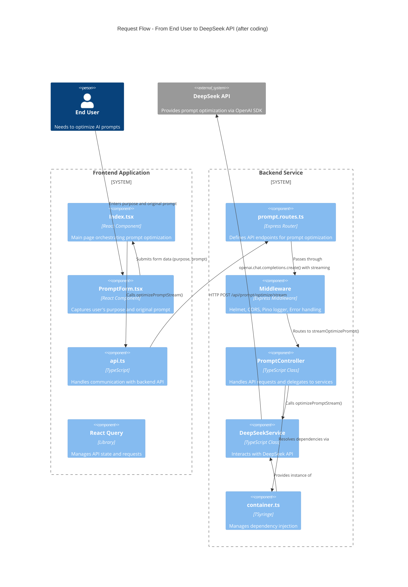

```mermaid
C4Component
title Request Flow - From End User to DeepSeek API (after coding)

Person(user, "End User", "Needs to optimize AI prompts")
System_Boundary(frontend, "Frontend Application") {
    Component(indexPage, "Index.tsx", "React Component", "Main page orchestrating prompt optimization")
    Component(promptForm, "PromptForm.tsx", "React Component", "Captures user's purpose and original prompt")
    Component(apiService, "api.ts", "TypeScript", "Handles communication with backend API")
    Component(reactQuery, "React Query", "Library", "Manages API state and requests")
}

System_Boundary(backend, "Backend Service") {
    Component(promptRoutes, "prompt.routes.ts", "Express Router", "Defines API endpoints for prompt optimization")
    Component(middleware, "Middleware", "Express Middleware", "Helmet, CORS, Pino logger, Error handling")
    Component(promptController, "PromptController", "TypeScript Class", "Handles API requests and delegates to services")
    Component(deepseekService, "DeepSeekService", "TypeScript Class", "Interacts with DeepSeek API")
    Component(container, "container.ts", "TSyringe", "Manages dependency injection")
}

System_Ext(deepseekApi, "DeepSeek API", "Provides prompt optimization via OpenAI SDK")

Rel(user, promptForm, "Enters purpose and original prompt")
Rel(promptForm, indexPage, "Submits form data (purpose, prompt)")
Rel(indexPage, apiService, "Calls optimizePromptStream()")
Rel(apiService, promptRoutes, "HTTP POST /api/prompt/optimize/stream")
Rel_R(promptRoutes, middleware, "Passes through")
Rel(middleware, promptController, "Routes to streamOptimizePrompt()")
Rel(promptController, container, "Resolves dependencies via")
Rel(container, deepseekService, "Provides instance of")
Rel(promptController, deepseekService, "Calls optimizePromptStream()")
Rel(deepseekService, deepseekApi, "openai.chat.completions.create() with streaming")
``` 