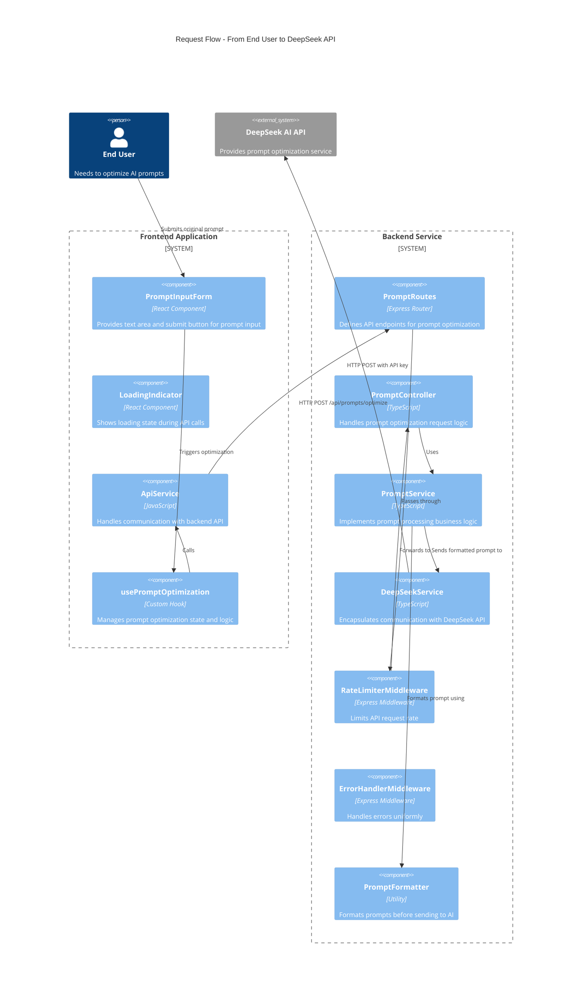

```mermaid
C4Component
title Request Flow - From End User to DeepSeek API

Person(user, "End User", "Needs to optimize AI prompts")
System_Boundary(frontend, "Frontend Application") {
    Component(promptInputForm, "PromptInputForm", "React Component", "Provides text area and submit button for prompt input")
    Component(loadingIndicator, "LoadingIndicator", "React Component", "Shows loading state during API calls")
    Component(apiService, "ApiService", "JavaScript", "Handles communication with backend API")
    Component(usePromptOptimization, "usePromptOptimization", "Custom Hook", "Manages prompt optimization state and logic")
}

System_Boundary(backend, "Backend Service") {
    Component(promptRoutes, "PromptRoutes", "Express Router", "Defines API endpoints for prompt optimization")
    Component(promptController, "PromptController", "TypeScript", "Handles prompt optimization request logic")
    Component(promptService, "PromptService", "TypeScript", "Implements prompt processing business logic")
    Component(deepSeekService, "DeepSeekService", "TypeScript", "Encapsulates communication with DeepSeek API")
    Component(rateLimiterMiddleware, "RateLimiterMiddleware", "Express Middleware", "Limits API request rate")
    Component(errorHandlerMiddleware, "ErrorHandlerMiddleware", "Express Middleware", "Handles errors uniformly")
    Component(promptFormatter, "PromptFormatter", "Utility", "Formats prompts before sending to AI")
}

System_Ext(deepseekApi, "DeepSeek AI API", "Provides prompt optimization service")

Rel(user, promptInputForm, "Submits original prompt")
Rel(promptInputForm, usePromptOptimization, "Triggers optimization")
Rel(usePromptOptimization, apiService, "Calls")
Rel(apiService, promptRoutes, "HTTP POST /api/prompts/optimize")
Rel_R(promptRoutes, rateLimiterMiddleware, "Passes through")
Rel_D(rateLimiterMiddleware, promptController, "Forwards to")
Rel(promptController, promptService, "Uses")
Rel(promptService, promptFormatter, "Formats prompt using")
Rel(promptService, deepSeekService, "Sends formatted prompt to")
Rel(deepSeekService, deepseekApi, "HTTP POST with API key")
``` 