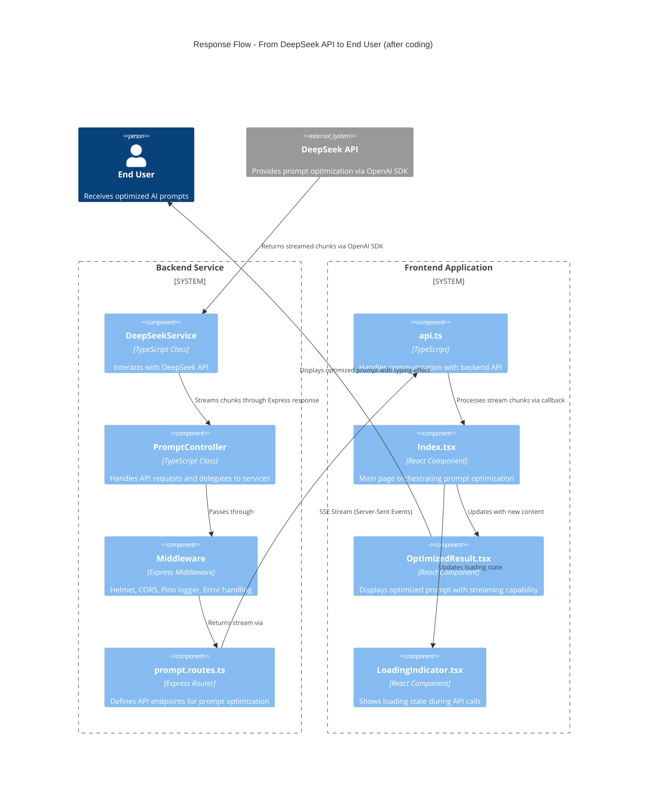

```mermaid
C4Component
title Response Flow - From DeepSeek API to End User (after coding)

Person(user, "End User", "Receives optimized AI prompts")
System_Ext(deepseekApi, "DeepSeek API", "Provides prompt optimization via OpenAI SDK")

System_Boundary(backend, "Backend Service") {
    Component(deepseekService, "DeepSeekService", "TypeScript Class", "Interacts with DeepSeek API")
    Component(promptController, "PromptController", "TypeScript Class", "Handles API requests and delegates to services")
    Component(middleware, "Middleware", "Express Middleware", "Helmet, CORS, Pino logger, Error handling")
    Component(promptRoutes, "prompt.routes.ts", "Express Router", "Defines API endpoints for prompt optimization")
}

System_Boundary(frontend, "Frontend Application") {
    Component(apiService, "api.ts", "TypeScript", "Handles communication with backend API")
    Component(indexPage, "Index.tsx", "React Component", "Main page orchestrating prompt optimization")
    Component(optimizedResult, "OptimizedResult.tsx", "React Component", "Displays optimized prompt with streaming capability")
    Component(loadingIndicator, "LoadingIndicator.tsx", "React Component", "Shows loading state during API calls")
}

Rel(deepseekApi, deepseekService, "Returns streamed chunks via OpenAI SDK")
Rel(deepseekService, promptController, "Streams chunks through Express response")
Rel(promptController, middleware, "Passes through")
Rel(middleware, promptRoutes, "Returns stream via")
Rel(promptRoutes, apiService, "SSE Stream (Server-Sent Events)")
Rel(apiService, indexPage, "Processes stream chunks via callback")
Rel(indexPage, optimizedResult, "Updates with new content")
Rel(indexPage, loadingIndicator, "Updates loading state")
Rel(optimizedResult, user, "Displays optimized prompt with typing effect")
``` 