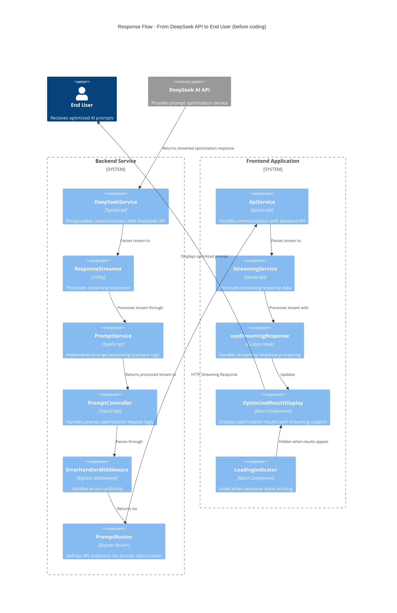

```mermaid
C4Component
title Response Flow - From DeepSeek API to End User (before coding)

Person(user, "End User", "Receives optimized AI prompts")
System_Ext(deepseekApi, "DeepSeek AI API", "Provides prompt optimization service")

System_Boundary(backend, "Backend Service") {
    Component(deepSeekService, "DeepSeekService", "TypeScript", "Encapsulates communication with DeepSeek API")
    Component(responseStreamer, "ResponseStreamer", "Utility", "Processes streaming responses")
    Component(promptService, "PromptService", "TypeScript", "Implements prompt processing business logic")
    Component(promptController, "PromptController", "TypeScript", "Handles prompt optimization request logic")
    Component(errorHandlerMiddleware, "ErrorHandlerMiddleware", "Express Middleware", "Handles errors uniformly")
    Component(promptRoutes, "PromptRoutes", "Express Router", "Defines API endpoints for prompt optimization")
}

System_Boundary(frontend, "Frontend Application") {
    Component(apiService, "ApiService", "JavaScript", "Handles communication with backend API")
    Component(streamingService, "StreamingService", "JavaScript", "Processes streaming response data")
    Component(useStreamingResponse, "useStreamingResponse", "Custom Hook", "Handles streaming response processing")
    Component(optimizedResultDisplay, "OptimizedResultDisplay", "React Component", "Displays optimization results with streaming support")
    Component(loadingIndicator, "LoadingIndicator", "React Component", "Hides when response starts arriving")
}

Rel(deepseekApi, deepSeekService, "Returns streamed optimization response")
Rel(deepSeekService, responseStreamer, "Passes stream to")
Rel(responseStreamer, promptService, "Processes stream through")
Rel(promptService, promptController, "Returns processed stream to")
Rel(promptController, errorHandlerMiddleware, "Passes through")
Rel(errorHandlerMiddleware, promptRoutes, "Returns via")
Rel(promptRoutes, apiService, "HTTP Streaming Response")
Rel(apiService, streamingService, "Passes stream to")
Rel(streamingService, useStreamingResponse, "Processes stream with")
Rel(useStreamingResponse, optimizedResultDisplay, "Updates")
Rel(loadingIndicator, optimizedResultDisplay, "Hidden when results appear")
Rel(optimizedResultDisplay, user, "Displays optimized prompt")
``` 